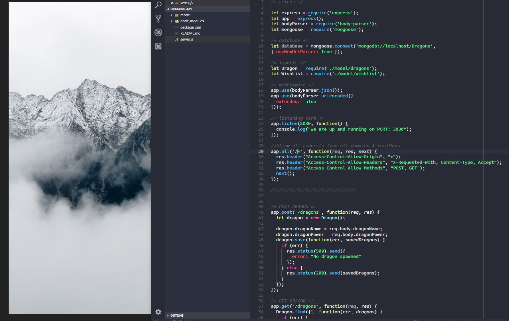

# Dragons API - Node, MongoDB { mongoose } & REST API's

---

## Project Objective
Build a REST API app that is both *functional* and *scallable* to consume data using **```Postman : GET, PUT & POST ```** requests. Install ```Node``` and learn Node Basics to build your first API.

***

## Requirements
#### Requirement Number One:
- Learn to building Your First API, and start using Postman. Send ```GET & POST``` requests.
- Learn about URL Parameters & Delete requests. 
- Start working with the Mongo Shell, learn to search for documents, how to delete and create documentation.
- Creating the Models for the project, posting products, fetching products and populating data

***

## Project Thumbnails:


